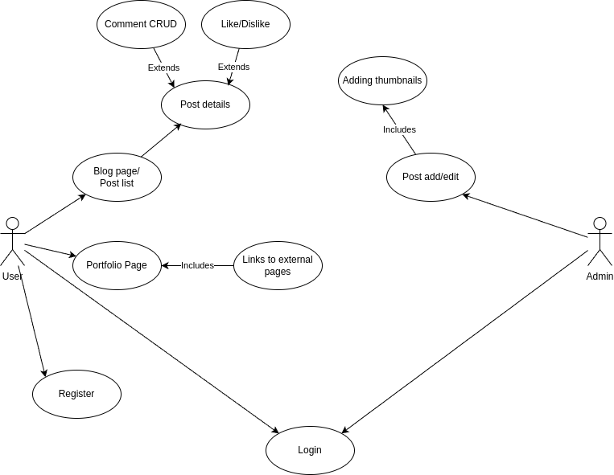

# Portfolio + Blog

This app is a simple portfolio website. It features a main page, which displays owner's skills, experiences, and completed projects. Links to the GitHub page and projects are also present on this page.

App also features a blog. Owner has an ability to add and edit new posts using markdown, including a thumbnail. Posts are then displayed on the blog page, where logged in users can see more details, as well as leave comments and reactions.

# Features:

- Portfolio main page
- Blog main page, displaying posts
- Pagination
- Authentication and authorization
- Post create and edit pages, available only for the owner
- Post details page
- Writing, editing, and deleting comments
- Leaving reactions

# Diagram

